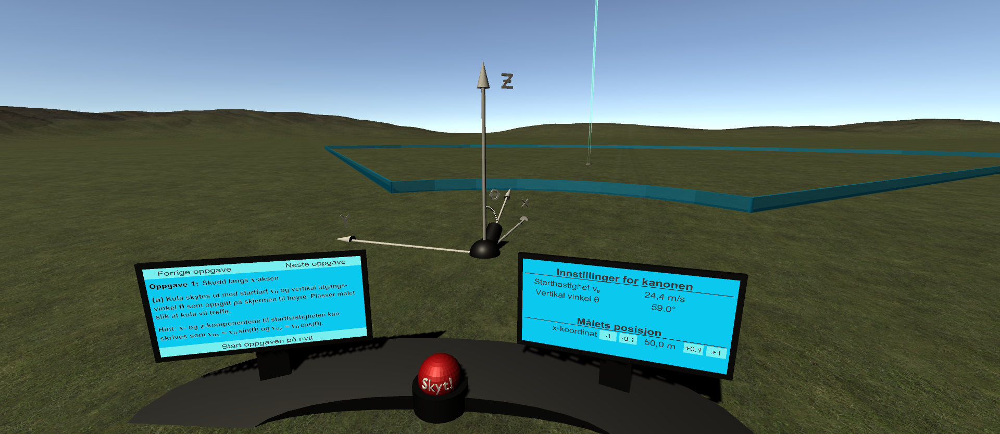

# Helt kanon!
Dette er prosjektet til gruppe 6 i landsbyen "VR og AR innen læring og trening" for våren 2021.

# Hvordan kjøre applikasjonen på oculus quest
Helt kanon er laget i Unity. Etter du har lastet ned prosjektet er du nødt til å installere pluginen "Oculus integration" i Unity Asset Store og legge denne inn i applikasjonen. Det ble bare kødd da vi prøvde å ha Oculus integration liggende inne i git.

Vi brukte [denne guiden](https://myvrprofessor.com/how-to-install-your-unity-game-on-oculus-quest-or-oculus-go/?fbclid=IwAR3sHoxXXsOx24wAWc9RZQuEwy_GSl3TghpWgblCFvumiSgZMAHlCVO3Vpk) for å sette opp alt riktig.

Spesielt viktig er det å sørge for at Unity-versjonen du bruker (som du finner i UnityHub) er bygget med såkalt "android build support". Hvis Unity-versjonen din er dette vil du få en liten android-figur på den. Den kan hende at du er nødt til å laste ned Unity-versjonen helt på nytt for å få Android build support :(

Etter man har fulgt alle stegene i guiden kan man koble Oculus-brillene til maskinen med USB og trykke seg inn på "File -> Build Settings", for deretter å trykke på "Build And Run" nederst til høyre i menyen som dukker opp.

# Brukermanual
Som en del av applikasjonen er det laget et dokument som inneholder brukermanual og oppgaveark. Dette dokumentet finnes på [denne linken](https://github.com/SimenHolmestad/prosjekt_kanon/blob/master/github_resources/Virtuell_kanon_for_fysikkundervisning.pdf).

# Promovideo
En promovideo av applikasjonen finnes her: <https://youtu.be/5lnUgqCKE-U>.

# Hvordan kjøre applikasjonen på maskinen uten VR-briller

For å kjøre applikasjonen på pc-skjermen (uten VR-briller) må du gå inn i Unity og deaktivere disse to spill-objektene:

- OVRPlayerController
- UIHelpers

Deretter aktiverer du disse spill-objektene:

- CameraObject
- FirstPersonPlayer
- Bird Camera
- Bullet Camera (under "Bullet")

Du kan så trykke på play-knappen i Unity for å starte programmet. Det burde nå være mulig å styre personen med piltastene og trykke på knapper med musepekeren. (knapper du vanligvis ville brukt laseren til å trykke på)
